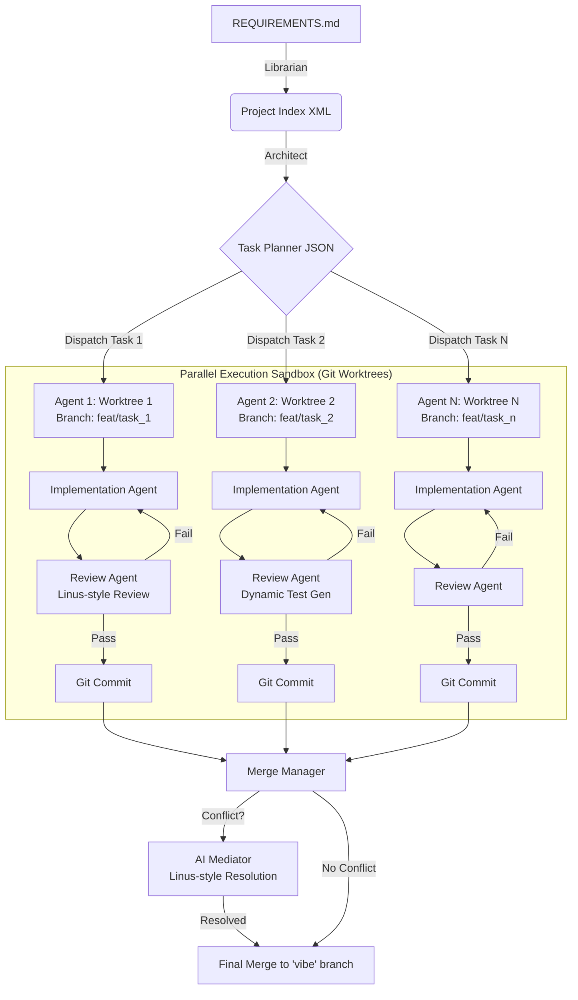

# VIBE FLOW v5.0: Git-Native Autonomous Coding Engine

**Vibe Flow** 是一个基于 Bash 和 Claude Code CLI 的自动化软件开发编排器。
v5.0 版本引入了 **Git-Native** 架构，彻底摒弃了脆弱的文本解析写入模式，转而利用 `git worktree` 构建物理隔离的并行开发环境，实现了真正的**多 Agent 协同开发**。

---

## 🏗️ 核心架构 (Architecture)

Vibe Flow 采用 **"Orchestrator-Worker" (编排者-工人)** 模式：

1.  **Orchestrator (Shell Script)**: 本项目的主脚本。它不负责写代码，只负责**资源调度**。扮演"技术经理"的角色，负责拆解任务、分配独立的工作区（Worktree）、监控进度以及合并成果。
2.  **Worker (Claude Code CLI)**: 实际的"工程师"。在 v5.0 中，我们移除了所有中间层解析器，**完全信任 Claude 的 Tool Use 能力**。Claude 直接在文件系统中读取、编辑、运行测试并提交 Git Commit。

### 核心变革：从 Patcher 到 Worktree
*   **Legacy (v4.0)**: Agent 输出代码文本 → Python 脚本正则解析 → 强制覆写文件。存在竞态条件（Race Conditions）和上下文截断风险。
*   **Current (v5.0)**: 主进程创建 `git worktree` → Agent 在隔离目录直接修改文件 → Agent 提交 Git Commit。**零竞态条件，原子性操作，原生版本控制。**

---

## 🔄 数据与控制流 (Data & Control Flow)

整个流水线分为四个阶段：感知、规划、执行、收敛。



### 1. 感知阶段 (Librarian)
*   **Input**: 当前代码库。
*   **Action**: 使用 `repomix` 生成 `raw_context.xml`，提取项目结构、API 签名和依赖关系。
*   **Output**: `project_index.xml` (轻量级上下文索引)。

### 2. 规划阶段 (Architect)
*   **Input**: `REQUIREMENTS.md` + `project_index.xml`。
*   **Action**: 调用 LLM 将需求拆解为可并行的任务列表。
*   **Output**: `vibe_plan.json` (包含任务 ID、描述、依赖关系)。

### 3. 执行阶段 (The Factory - Git Worktrees)
这是 v5.0 的核心。系统根据 `MAX_PARALLEL_AGENTS` 启动并行进程：
*   **Isolation**: 为每个任务创建一个 **Git Worktree**（`git worktree add ...`）。这是一个物理隔离的文件夹，但共享 `.git` 历史。
*   **Direct Action**: Claude Code 在该文件夹内运行。它直接修改源代码（无需 Python 解析），并通过 Review Agent 动态生成测试命令。
*   **Self-Healing**: 如果测试失败，Implementation Agent 会收到 Review Agent 的反馈并尝试修复。所有尝试都通过 Git Commit 记录。
*   **Review Agent**: 扮演 Linus Torvalds 角色，以"好品味"标准审查代码，动态生成适合当前领域和变更的测试命令。
*   **Result**: 每个任务产生一个包含若干 Commits 的 Feature Branch。

### 4. 收敛阶段 (Merge Manager)
*   **Action**: 主进程回收 Worktrees，切回主分支。
*   **Strategy**: 遍历所有任务分支进行 `git merge`。
*   **Conflict Resolution**: 如果合并遇到冲突（Conflict），系统会唤醒一个 **"Mediator Agent"**（Linus 角色）。该 Agent 读取 `git diff`，理解冲突逻辑，选择更简洁优雅的解决方案，直接在暂存区修复代码并完成合并。

### 5. 集成阶段 (Integration Phase) 🆕
*   **Trigger**: 所有分支合并完成后自动执行
*   **Action**: 运行全局测试套件（回归测试）
*   **System Healer**: 如果集成测试失败，启动 System Healer Agent
    - 具有全局视角（不同于只看单个 Worktree 的 Agent）
    - 分析集成失败原因（API 不匹配、副作用等）
    - 直接修复主分支代码
    - 最多 2 次修复尝试
*   **CTO Review**: 对整个 Session 进行架构审查
    - 对比 Session 开始和结束的代码差异
    - 识别架构不一致、冗余代码、安全风险
    - 生成质量评分和改进建议
    - 输出: `vibe_cto_report.md`

---

## ✨ 关键特性 (Key Features)

### 1. 🛡️ 物理级并行隔离 (True Parallelism)
通过 `git worktree`，Agent A 和 Agent B 在完全不同的目录中工作。Agent A 安装的 `npm` 依赖或产生的临时文件绝不会干扰 Agent B。彻底解决了多文件读写冲突。

### 2. 🤖 原生工具能力 (Native Tool Use)
不再让 LLM 像打印机一样输出代码块。Agent 像人类一样使用编辑器：
*   它只修改需要修改的几行（Diff）。
*   它不会因为 Output Token 限制而截断整个文件。
*   它可以创建、删除、移动文件。

### 3. 🩹 自愈与原子提交 (Self-Healing & Atomic Commits)
Agent 的每一次尝试如果通过测试，就会生成一个 Git Commit。如果失败，它会在当前分支继续修改。这意味着所有的开发尝试都是可追溯、可回滚的。

### 4. 👨‍⚖️ Review Agent (Linus-style Code Review)
专门的 Review Agent 扮演 Linus Torvalds 角色，使用以下哲学审查代码：
- **Good Taste**: 代码应该简洁优雅，没有特殊情况
- **Clarity Over Cleverness**: 如果不明显，就是错的
- **Never Break Userspace**: 不引入破坏性变更
- **Resource Management**: 每个分配都必须有明确的释放路径
- **Error Handling**: 显式处理错误，没有静默失败

Review Agent 同时动态生成适合当前领域（HARDWARE, WEB, PYTHON等）和具体变更的测试命令。

### 5. ⚖️ 智能冲突解决 (AI Mediator)
当多个 Agent 修改了同一行代码时，普通的脚本会报错停止。Vibe Flow 会启动专门的 Mediation 流程，让 Linus 风格的 AI 充当代码审查员，应用"好品味"原则选择更简洁的解决方案，甚至编写全新的第三种方案。

---

## 📂 目录结构

运行脚本后，你的项目目录将发生以下变化：

```text
root/
├── .vibe_logs/             # 所有 Agent 的交互日志 (用于调试)
├── .vibe_worktrees/        # [临时] 并行工作的物理目录 (任务完成后自动清理)
│   ├── task_1/             # Agent 1 的工作区
│   └── task_2/             # Agent 2 的工作区
├── project_index.xml       # 代码库索引
├── vibe_plan.json          # 任务计划
├── vibe_report.md          # 最终生成报告
└── (Git Branches)          # 生成多个 feat/task_x 分支
```

---

## 🚀 快速开始

```bash
# 1. 确保依赖已安装
# 需要: git, claude, jq, npx (repomix), node, python3

# 2. 准备需求
echo "重构登录模块，增加 OAuth 支持" > REQUIREMENTS.md

# 3. 运行 Vibe Flow
chmod +x vibe.sh
./vibe.sh
```

### 配置选项

在脚本开头或通过环境变量调整以下参数：

```bash
MAX_RETRIES=3                    # 最大重试次数
MAX_PARALLEL_AGENTS=2            # 并行 Agent 数量 (env: MAX_PARALLEL_AGENTS=4)
INDEX_FILE="project_index.xml"
PLAN_FILE="vibe_plan.json"
REPORT_FILE="vibe_report.md"
LOG_DIR=".vibe_logs"
```

---

## 🎯 支持的领域

| 领域 | 识别标志 | Review Agent 行为 |
|------|----------|-------------------|
| **HARDWARE** | `platformio.ini`, `CMakeLists.txt` | 生成 PlatformIO 测试命令 |
| **AI_ROBOT** | `mamba_env.yaml`, `src/ros2` | 生成 pytest 测试命令 |
| **WEB** | `package.json`, `next.config.js` | 生成 npm test 或特定组件测试 |
| **PYTHON_GENERIC** | `*.py` 文件 | 生成 pytest 测试命令 |
| **GENERIC** | 其他 | 根据代码内容动态决定 |

---

## 🔍 调试与监控

### 查看 Agent 工作区
```bash
# Agent 还在运行时，可以直接查看其工作目录
cd .vibe_worktrees/task_1
git log  # 查看 Agent 的提交历史
git diff HEAD~1  # 查看最新变更
```

### 查看分支拓扑
```bash
git log --graph --all --oneline
```

### 查看 Review 报告
```bash
cat .vibe_logs/review_report_task_1.md
```

---

## 🚨 注意事项

- **首次运行**会自动初始化 git 仓库并创建 `vibe` 分支
- **确保 `.gitignore`** 包含 `node_modules/`, `venv/`, `__pycache__/` 等，否则会占用大量磁盘空间
- **Agent 会自动更新 `.gitignore`** 如果发现缺失的模式
- **Worktree 占用磁盘**: 每个任务一份代码副本，但共享 `.git`（节省空间）
- **依赖安装**: Agent 可能在每个 Worktree 中安装依赖，可通过提示词优化

---

## 📄 架构优势总结

> **"从解析代码到原生 Git"** - v5.0 的核心价值

1. **去除脆弱中间层**: 没有 Python 解析器，如果 Claude 写错代码，它就是 Git 里的一行错误 Diff，而不是导致脚本崩溃的异常
2. **完全隔离**: Agent A 的 `npm install` 或临时文件完全不会影响 Agent B
3. **可调试性极强**: 随时 `cd .vibe_worktrees/task_1` 查看 Agent 的工作
4. **可视化开发过程**: `git log --graph --all` 展示漂亮的分支图谱
5. **Review 与 Test 分离**: 专门的 Review Agent 以 Linus 标准审查 + 动态测试生成

---

## 📝 许可证

本项目采用开源许可证，详见 LICENSE 文件。

---

*让 AI 为你打工，在休眠模式下也能高效完成开发任务！*