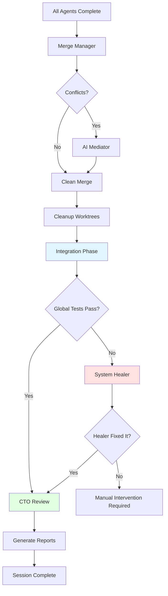

# Integration Phase & CTO Review Enhancement

## Overview
Based on team feedback regarding "Integration Hell" problems, we've added a comprehensive quality assurance phase to Vibe Flow v5.0 that executes **after** all branches are merged.

## The Problem Identified

Even when individual agents pass their unit tests in isolation, merging can introduce:
1. **API Mismatches**: Agent A changes a function signature, Agent B calls the old version
2. **Side Effects**: Agent A modifies DB schema, Agent B assumes old schema
3. **Style Inconsistency**: Mixed naming conventions, formatting issues
4. **Integration Failures**: Code that works alone fails when combined

## Solution: Two-Phase Quality Assurance

### Phase 1: Integration Testing with System Healer
**Location**: After `merge_manager`, before final report  
**Function**: `run_integration_phase()`

**What it does:**
1. Runs **global test suite** (full regression tests)
2. If tests pass → Success!
3. If tests fail → Activates **System Healer**

**System Healer:**
- Has **global perspective** (unlike individual agents who only see their worktrees)
- Analyzes integration test failures
- Identifies root causes (API mismatches, side effects)
- Fixes code directly in main branch
- Re-runs tests to validate fix
- Maximum 2 healing attempts

**Philosophy**: Apply Linus principles at system level:
- Fix root cause, not symptoms
- Prefer simple solutions
- If multiple modules are wrong, fix them all

### Phase 2: CTO Architectural Review
**Location**: After integration phase  
**Function**: `run_cto_review()`

**What it does:**
1. Compares code from session start (`START_HASH`) to end (`HEAD`)
2. Reviews all commits made during session
3. Generates architectural audit report

**Review Criteria:**
- Architectural inconsistencies
- Redundant code from parallel agents
- Security risks
- API design issues
- Code style violations

**Output**: `vibe_cto_report.md` with:
- Executive Summary
- Quality Score (1-10)
- Issues by severity (CRITICAL/HIGH/MEDIUM/LOW)
- Recommendations

## Implementation Details

### New Functions Added

#### `run_integration_phase()`
```bash
# Lines 199-270 in vibe.sh
- Determines domain-specific test command
- Runs global test suite
- On failure: launches System Healer
- System Healer has 2 attempts to fix
- Returns 0 on success, 1 on failure
```

#### `run_cto_review()`
```bash
# Lines 272-323 in vibe.sh
- Takes START_HASH as argument
- Generates git diff and commit log
- Prompts Claude as CTO
- Outputs architectural review report
- Displays summary to console
```

### Main Flow Changes

```bash
# Record session start
START_HASH=$(git rev-parse HEAD)

# ... (librarian, architect, agents, merge) ...

# NEW: Integration Phase
run_integration_phase "$DOMAIN"

# NEW: CTO Review
run_cto_review "$START_HASH"

# Final report generation
...
```

## Workflow Visualization



## Benefits

### 1. Catches Integration Issues Automatically
**Before**: Agents pass individual tests, merge succeeds, but app crashes  
**After**: System Healer identifies and fixes integration issues

### 2. Global Perspective
**Before**: Each agent only knows about its worktree  
**After**: System Healer sees the entire codebase and can fix cross-module issues

### 3. Architectural Consistency
**Before**: No visibility into code quality across parallel agents  
**After**: CTO Review identifies style drift, redundancy, and architectural issues

### 4. Mirrors Real Teams
This workflow now mirrors professional development:
1. **Developers** → Individual Agents
2. **Code Review** → Review Agent (per-task)
3. **CI/CD** → Integration Phase
4. **Senior Engineer** → System Healer
5. **Tech Lead** → CTO Review

## Example Scenario

### Problem:
- Agent A: Implements `login(email, password)`
- Agent B: Implements dashboard calling `login(username, password)`
- Both pass individual tests (mocked data)
- Merge succeeds (no text conflicts)
- **Integration test fails**: Dashboard can't authenticate

### Solution:
1. **Integration Phase** runs global tests → FAIL
2. **System Healer** analyzes error log:
   ```
   TypeError: login() missing 1 required positional argument: 'password'
   ```
3. **System Healer** understands:
   - Agent A changed signature to `login(email, password)`
   - Agent B still uses `login(username, password)`
4. **System Healer** chooses simpler fix:
   - Update Agent B's call to match new signature
   - Or standardize on `username` if that's better
5. **Commits fix**: "System Healer: Fixed login API mismatch"
6. **Re-runs tests** → PASS
7. **CTO Review** notes: "API change needs documentation"

## Testing Recommendations

### Test 1: Simple Integration Success
```bash
echo "Add two functions: greet() and farewell()" > REQUIREMENTS.md
./vibe.sh
# Expected: Integration tests pass, CTO review shows good quality
```

### Test 2: Integration Failure & Healing
```bash
cat > REQUIREMENTS.md << EOF
Task 1: Create utils.js with function add(a, b)
Task 2: Create app.js that calls add(x, y, z)  # Wrong signature!
EOF
./vibe.sh
# Expected: Integration fails, System Healer fixes app.js
```

### Test 3: Architectural Review
```bash
# Create scenario with style inconsistencies
cat > REQUIREMENTS.md << EOF
Task 1: Add camelCase functions to module1.js
Task 2: Add snake_case functions to module2.js
EOF
./vibe.sh
# Expected: CTO review flags inconsistent naming
```

## Log Files Generated

- `.vibe_logs/integration_system.log` - Integration test output and healing attempts
- `vibe_cto_report.md` - Architectural review report
- All existing logs remain unchanged

## Configuration

No new environment variables needed. The integration phase uses:
- `$DOMAIN` - To determine test command
- `$MAX_RETRIES` - Applied to System Healer (currently 2)
- `START_HASH` - Captured automatically at session start

## Conclusion

The Integration Phase with System Healer and CTO Review addresses the team's concern about "Integration Hell" by:
1. **Automatically detecting** integration failures
2. **Intelligently fixing** cross-module issues
3. **Ensuring quality** through architectural review

This transforms Vibe Flow from a parallel execution engine into a **complete autonomous development system** with comprehensive quality assurance.
