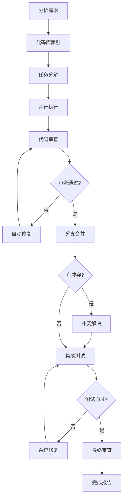

# VIBE FLOW

Personal workflow automation tool for AI-assisted development.

---

## 📖 关于这个项目

**Vibe Flow** 是我个人工作流自动化的工具，基于以下原则构建：

- **个人项目**：这是我为了提升个人开发效率创建的工具
- **依赖核心AI**：核心能力来自 [Claude Code](https://claude.com/claude-code) 和 [SuperClaude](https://github.com) 命令集
- **Git原生**：使用Git worktree确保文件安全，支持并行开发
- **质量保证**：通过对抗式审查和自动化测试保证代码质量

这个工具本质上是一个**工作流编排器**，协调多个AI代理在隔离的Git工作树中并行工作。

---

## 🛠️ 核心功能

| 功能 | 说明 |
|------|------|
| **🏗️ 任务规划** | 分析需求，自动分解为可并行的子任务 |
| **⚡ 并行执行** | 在独立的Git worktree中并发处理任务 |
| **🧐 对抗式审查** | 多轮代码审查，强制执行简洁性和质量标准 |
| **🔀 智能合并** | 自动处理分支合并和冲突解决 |
| **🧪 集成测试** | 全系统回归测试和自动修复 |
| **📊 质量报告** | 最终架构审查和代码质量评估 |

---

## 🏗️ 工作流程



---

## 🛠️ 安装和使用

### 环境要求

- Git
- Node.js & npm
- Python 3
- Claude CLI (Anthropic)
- jq

### 安装方式

```bash
npm install -g @jingyi_qiu/vibe-flow
```

### 基本使用

1. 在项目根目录创建 `REQUIREMENTS.md` 文件，描述你的需求
2. 运行：

```bash
vibe
```

3. 工具会自动：
   - 分析代码库和需求
   - 生成任务计划
   - 并行执行任务
   - 进行代码审查和测试
   - 合并结果并生成报告

### 环境变量配置

```bash
# 并行代理数量 (默认: 2)
MAX_PARALLEL_AGENTS=4 vibe

# 最大重试次数 (默认: 3)
MAX_RETRIES=5 vibe
```

---

## 🏗️ 技术架构

**执行管道**：

1. **Librarian** - 代码库索引和语义分析
2. **Architect** - 基于需求的任务规划
3. **Factory** - 并行代理执行
4. **Review** - 对抗式代码审查
5. **Merge** - 分支集成和冲突解决
6. **Integration** - 系统级测试和修复
7. **Audit** - 最终质量审查

**核心机制**：
- **Git Worktree隔离**：每个任务在独立环境中执行
- **多轮审查循环**：确保代码质量符合标准
- **自动冲突解决**：AI协调员处理合并冲突
- **集成测试驱动**：全系统回归测试保证稳定性

---

## 📋 项目状态

- **维护状态**：个人项目，持续改进中
- **稳定性**：核心功能经过实战测试
- **适用场景**：适合个人项目的快速原型开发和重构

---

## 📄 许可证

MIT License

---

*注：这是一个个人工作流工具，核心智能来自 Claude Code 和 SuperClaude 命令集。*